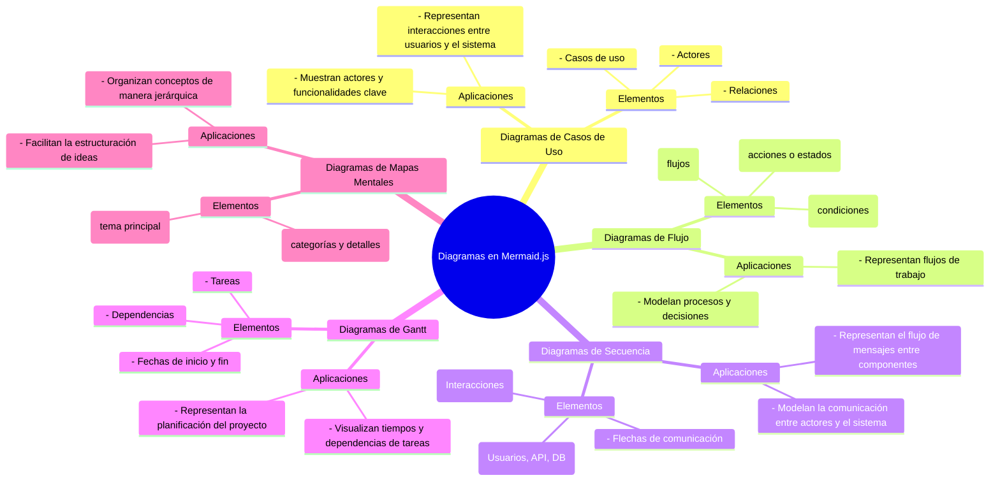
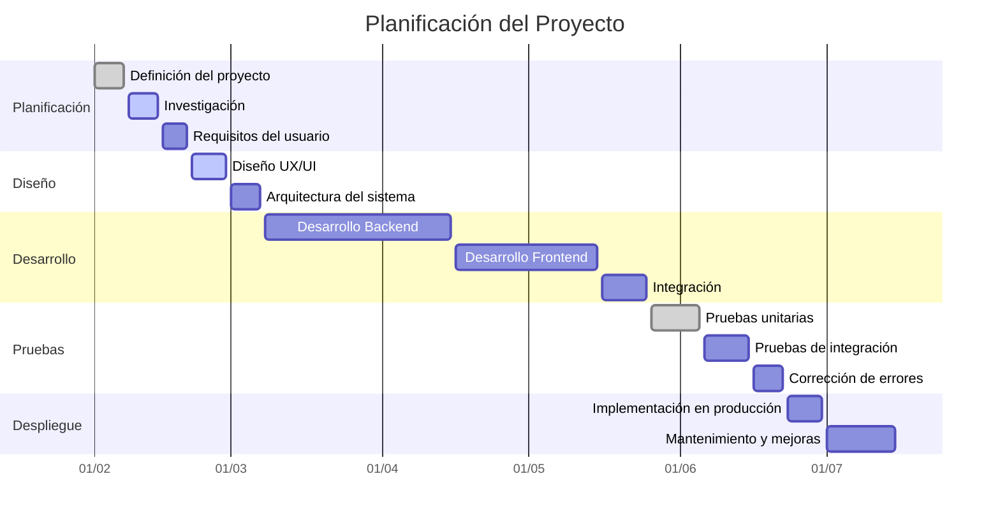
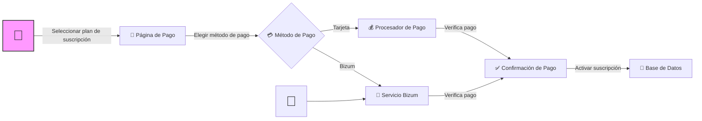
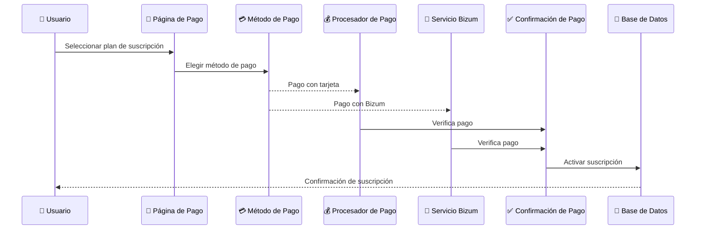
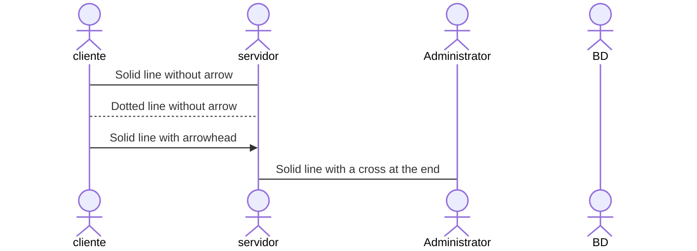

# Herramientas para generar documentación

## **Definición de Markdown**

Markdown es un lenguaje de marcado ligero que permite formatear texto de manera sencilla utilizando una sintaxis fácil de leer y escribir. Es ampliamente utilizado en documentación técnica, wikis, README de proyectos y blogs debido a su simplicidad y compatibilidad con múltiples plataformas.

**Principales características de Markdown:**

- **Texto estructurado** con encabezados (`#`), listas, negritas (`**`), cursivas (`*`), y más.
- **Fácil de leer** incluso en su forma sin procesar.
- **Soporte para código** con bloques de código usando triple acento grave (```).
- **Enlaces e imágenes** integrados de forma sencilla.
- **Compatible con HTML**, lo que permite añadir etiquetas si es necesario.

### Referencias principales

- **Guía de Markdown:** Una referencia completa y de código abierto que explica cómo utilizar Markdown para formatear documentos de texto plano. [Guía de Markdown](https://www.markdownguide.org/)

- **Sintaxis Básica de Markdown:** Un resumen de la sintaxis básica de Markdown, útil para quienes se inician en su uso. [Guía de Markdown](https://www.markdownguide.org/basic-syntax/)

- **Cheat sheet**:[foursquare](https://support.squarespace.com/hc/en-us/articles/206543587-Markdown-cheat-sheet)

- **IA + MARKDOWN** [Generación de documentación](https://4geeks.com/es/lesson/httpsgithubcombreatheco-deapplied-ai-syllabusblobmaincontentmodule-5-documentsfrom-markdown-to-everythingesmd)

## **Mermaid**

Mermaid es una herramienta que permite la creación de diagramas y gráficos utilizando una sintaxis basada en texto dentro de Markdown. Se usa para representar visualmente flujos de trabajo, diagramas de clases, diagramas de Gantt, casos de uso, y otros tipos de esquemas.

**Principales características de Mermaid:**

- **Integración con Markdown**, ideal para documentación técnica.
- **Soporte para múltiples tipos de diagramas**, incluyendo:
  - Diagramas de flujo (`graph TD` o `graph LR`).
  - Diagramas de Gantt (`gantt`).
  - Diagramas de secuencia (`sequenceDiagram`).
  - Diagramas de clases (`classDiagram`).
  - Diagramas de casos de uso UML (`erDiagram`).
- **Sintaxis sencilla y legible**, lo que facilita su edición y mantenimiento.
- **Renderizado en muchas plataformas** como GitHub, GitLab, Notion, y VS Code.

### **Mapa de tipos mermaid**



### **Referencias:**

- **Sitio Oficial de Mermaid:** Ofrece documentación detallada sobre cómo crear diagramas y gráficos utilizando Mermaid. [Sitio Oficial](https://mermaid.js.org)

- **Repositorio de GitHub de Mermaid:** Contiene el código fuente de Mermaid, ejemplos y documentación adicional. [Repositorio de GitHub](https://github.com/mermaid-js/mermaid?utm_source=chatgpt.com)

- **Ejemplos de gráficos** [ideas de graficos y presentaciones](https://clickup.com/blog/mermaid-diagram-examples/)

## **Índice en Markdown**

Markdown no tiene una sintaxis nativa para generar un índice automáticamente, pero puedes crear uno manualmente con enlaces a secciones utilizando anclajes.

### Índice

1. [Introducción](#introduccion)
2. [Descripción del Proyecto](#descripción-del-proyecto)
   - [Objetivos](#objetivos)
   - [Público Objetivo](#público-objetivo)

```markdown
1. [Introducción](#introduccion)
2. [Descripción del Proyecto](#descripcion-del-proyecto)
   - [Objetivos](#objetivos)
   - [Público Objetivo](#publico-objetivo)
```

#### Introduccion

Aquí comienza la introducción.

#### Descripción del Proyecto

Descripción del proyecto

#### Objetivos

Descripción de los objetivos.

#### Público Objetivo

Explicación sobre el público objetivo.

## **Tabla de Imágenes en Markdown**

Puedes organizar imágenes en una tabla utilizando la sintaxis de Markdown:

```markdown
#### Tabla de Imágenes

| Descripción           | Imagen  |
|----------------------|---------|
| Logotipo del Proyecto |  |
| Diagrama de Casos de Uso |  |
| Captura de Pantalla de App |  |
```

 **Nota**: Sustituye `ruta/logo.png`, `ruta/diagrama.png`, etc., por la ubicación real de las imágenes en tu proyecto.

---

### **Tabla de Datos en Markdown**

Si necesitas mostrar datos en formato tabular:

```markdown
# Tabla de Características del Proyecto

| Funcionalidad        | Descripción |
|----------------------|-------------|
| Registro de Usuarios | Permite a los usuarios crear una cuenta. |
| Autenticación       | Inicio de sesión seguro con JWT. |
| Panel de Administración | Dashboard con métricas y gestión de usuarios. |
| API REST           | Endpoints para integraciones externas. |
```

---

## Ejemplo Gantt

Un **diagrama de Gantt** es una herramienta de gestión de proyectos que representa visualmente el cronograma de tareas a lo largo del tiempo. Permite planificar, coordinar y hacer un seguimiento del progreso de un proyecto de manera clara y estructurada.

---

### **Elementos principales de un Gantt**

1. **Tareas:** Actividades o fases del proyecto que deben completarse.
2. **Fechas:** Indican el inicio y fin de cada tarea.
3. **Duración:** Representada por la longitud de las barras, muestra cuánto tiempo tomará cada tarea.
4. **Dependencias:** Relaciones entre tareas, indicando cuáles dependen de la finalización de otras.
5. **Progreso:** Algunas herramientas permiten marcar el porcentaje de avance de cada tarea.
6. **Hitos:** Eventos clave o entregables importantes dentro del proyecto.
7. **Recursos:** Opcionalmente, se pueden asignar responsables a cada tarea.

---

El **diagrama de Gantt en Mermaid** permite visualizar estas fases fácilmente dentro de documentación en **Markdown**, facilitando la gestión y planificación de proyectos. 🚀

### Diagrama de Gantt del Proyecto



### **Explicación del diagrama de Gantt**

- **Cada tarea tiene una fecha de inicio y fin.**
- **Las fases están agrupadas en secciones:**
  - **Planificación**: definición del proyecto, investigación y requisitos.
  - **Diseño**: diseño UX/UI y arquitectura.
  - **Desarrollo**: backend, frontend e integración.
  - **Pruebas**: unitarias, integración y corrección de errores.
  - **Despliegue**: implementación en producción y mantenimiento.

Este diagrama puede adaptarse a los plazos reales del proyecto. 🚀

---

## Casos de uso

### Caso de uso mediante un diagrama de flujo



### Caso de uso mediante un diagrama de secuencia



### Caso de uso mediante un diagrama de secuencia



### Referencias

- [Utilizacion mermaid](https://educacion.bilateria.org/diagramas-mermaid-en-educacion-y-su-aplicacion-al-dua-a-traves-de-chatgpt)

- [use case diagram 1] (https://gist.github.com/infrony/acf8d05d7ae86efcb602bb129a5922dc) 

- [use case diagram 2] (https://agilemodeling.com/style/usecasediagram.htm)

- [use case diagram 3] (https://www.edrawsoft.com/article/use-case-diagram-examples.html)
