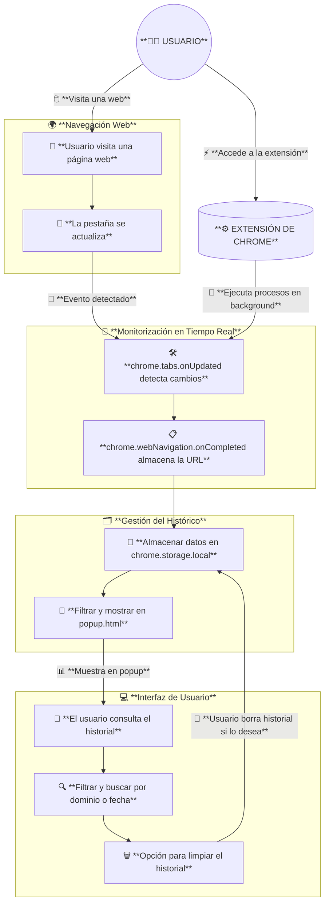

## **🔥 Reto: "Monitor de Navegación Inteligente"**  

### **📌 Objetivo**

Desarrollar una extensión para Chrome que:

1. **Registre en tiempo real** los sitios visitados por el usuario.
2. **Genere un histórico** persistente almacenado en `chrome.storage.local`.
3. **Muestre estadísticas de navegación** (sitios más visitados, tiempo en cada sitio).
4. **Permita filtrar y buscar** en el histórico.
5. **Evite registrar ciertos dominios sensibles** (como páginas de configuración de Chrome).

---

## **📂 Requisitos técnicos**

### **1️⃣ Estructura del proyecto**

📂 **MonitorExtension/**  
├── 📄 manifest.json  
├── 📂 icons/ (iconos de la extensión)  
├── 📄 background.js (gestiona eventos en segundo plano)  
├── 📄 popup.html (interfaz gráfica)  
├── 📄 popup.js (lógica del frontend)  
├── 📄 styles.css (estilos de la interfaz)  
├── 📄 history.js (gestiona el almacenamiento y visualización del historial)  

---

### **2️⃣ Funcionalidades obligatorias**

✅ **Registro en tiempo real**  
- Usar `chrome.tabs.onUpdated.addListener` y `chrome.webNavigation.onCompleted.addListener` para detectar cambios de URL.  
- Almacenar la URL, título, fecha y hora en `chrome.storage.local`.  

✅ **Gestión del histórico**  

- Almacenar hasta **los últimos 1000 registros** (FIFO si se supera el límite).  
- Permitir al usuario **limpiar el histórico** manualmente.  

✅ **Interfaz intuitiva**  

- Mostrar una **lista con los sitios visitados** en `popup.html`.  
- **Opciones de filtrado** (buscar por dominio, por fecha).  

✅ **Evitar registrar sitios internos**  

- Filtrar páginas como `chrome://*`, `about:blank`, y otros sitios de configuración.  

---

### **3️⃣ Desafíos avanzados (opcional)**
🚀 **Registro de tiempo en cada sitio**  
- Medir el **tiempo total de permanencia** en cada dominio.  
- Mostrar **estadísticas de navegación** en gráficos con Chart.js.  

🚀 **Exportación del historial**  
- Permitir al usuario exportar su historial a **CSV o JSON**.  

🚀 **Sincronización en la nube**  
- Usar `chrome.storage.sync` para guardar el historial en la cuenta de Google.  

🚀 **Modo incógnito opcional**  
- Permitir al usuario activar/desactivar el registro en incógnito.  

---

## **📊 Evaluación**
🔹 **Correcto funcionamiento** de la monitorización en tiempo real.  
🔹 **Código modular y limpio** siguiendo buenas prácticas.  
🔹 **Interfaz clara y funcional**.  
🔹 **Uso eficiente de `chrome.storage.local`** para optimizar el almacenamiento.  

📌 **Entrega final**:  
- **ZIP con el código**.  
- **README con instrucciones de instalación y uso**.  

---

## Diagrama de caso de uso

