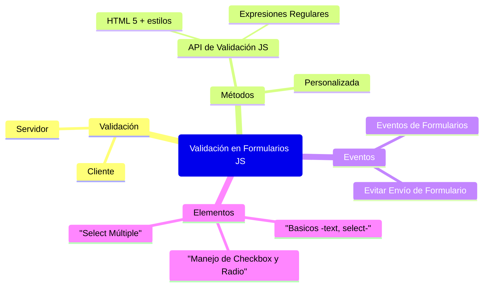

# Validación en Formularios JS



## Validación

### Cliente

- La validación en el cliente no es segura.
- Se usa para mejorar la usabilidad.
- Se realiza en tres momentos:
  - Al escribir.
  - Al cambiar de input.
  - Al enviar el formulario.

### Servidor

- La validación en el servidor es obligatoria para garantizar seguridad.
- Se realiza después de recibir los datos del usuario.

## Métodos

### API de Validación JS

- `checkValidity()`: verifica si un input o formulario es válido.
- `reportValidity()`: verifica y muestra mensajes de error.
- `validity`: contiene información sobre las reglas HTML incumplidas.
- `setCustomValidity('mensaje')`: establece un mensaje de error personalizado.

```javascript
let inputElement = document.getElementById("miInput");
if (!inputElement.checkValidity()) {
    alert("El campo no es válido");
}
```

**Bondades:** Rápido, fácil de usar con validaciones HTML5.

**Problemas:** No personaliza los mensajes de error.

### Uso de `novalidate`

- Se recomienda añadir el atributo `novalidate` en el `<form>` para personalizar validaciones con JS y evitar la validación automática del navegador.

```html
<form name="form_ex" novalidate>
    <input type="email" name="email_ex" required>
    <input type="submit">
</form>
```

### Personalizada

- Se usa `setCustomValidity()` para mostrar mensajes de error específicos.
- `reportValidity()` muestra los errores en pantalla.

#### Ejemplo y Consideraciones

```javascript
let inputElement = document.getElementById("miInput");
inputElement.addEventListener("input", function() {
    if (this.value.length < 3) {
        this.setCustomValidity("Debe tener al menos 3 caracteres");
    } else {
        this.setCustomValidity("");
    }
    this.reportValidity();
});
```

**Bondades:** Permite mensajes personalizados y flexibilidad en validaciones.

**Problemas:** Requiere mayor implementación manual.

### Evento `invalid`

- Se dispara cuando un campo no cumple una regla de validación.

```javascript
let emailInput = document.getElementById("email_ex");
emailInput.addEventListener("invalid", function() {
    alert("El email ingresado no es válido");
});
```

### Validación con Email Restringido

```javascript
document.forms["form_ex"].addEventListener("submit", function(evt) {
    if(document.forms["form_ex"]["mail"].value !== "ex@ex.com") {
        evt.preventDefault();
        alert("Solo se permite el email ex@ex.com");
    }
});
```

### HTML5 & JS con Estilos

```html
<style>
    input:valid { background-color: rgba(0, 121, 0, 0.356); }
    input:invalid { background-color: rgba(255, 0, 0, 0.349); }
</style>
<form name="form_ex" novalidate>
    <input type="text" name="nick" pattern="[A-z]{2,4}" required>
    <input type="submit">
</form>
```

### Manejo de Checkbox y Radio

- Se recorren los elementos con `document.forms['formulario']['campo']` y verificando `checked == true`.

```javascript
var radios = document.forms["form_ex"]["sex"];
for (var i = 0; i < radios.length; i++) {
    if (radios[i].checked) {
        alert("Seleccionado: " + radios[i].value);
    }
}
```

### Select Múltiple

- Se obtiene la lista de opciones seleccionadas con `selectedIndex` y `options`.

```javascript
var selector = document.forms["form_ex"]["listado"];
for (var i = 0; i < selector.options.length; i++) {
    if (selector.options[i].selected) {
        alert("Seleccionado: " + selector.options[i].text);
    }
}
```

## Ejemplo Completo de Validación Personalizada

```javascript
let form_ex = document.forms["form_ex"];
form_ex["nick"].addEventListener("input", function() {
    this.setCustomValidity('');
    if (!this.checkValidity()) {
        if (this.validity.patternMismatch) {
            this.setCustomValidity("Debe contener entre 2 y 4 letras");
            this.reportValidity();
        }
    }
});
```

## Referencias

[Validación de forms](https://developer.mozilla.org/es/docs/Learn_web_development/Extensions/Forms/Form_validation)

[setCustomValidity](https://developer.mozilla.org/en-US/docs/Web/API/HTMLObjectElement/setCustomValidity)

[ValidityState](https://developer.mozilla.org/en-US/docs/Web/API/ValidityState)

**Fin del documento**
---
